# 1. Preparació

## Tasques a Provar

- **Registrar-se i publicar un llibre**
- **Posar una ressenya en un llibre que no sigui teu**
- **Buscar un perfil d'un usuari**
- **Editar un llibre teu**
- **Guardar un llibre i trobar on es guarda**
- **Editar el teu perfil**
- **Eliminar la ressenya que abans s'ha afegit**
- **Posar una resposta a un comentari i mostrar-la**

---

## Verificació d'Accessibilitat

### Pàgina Home

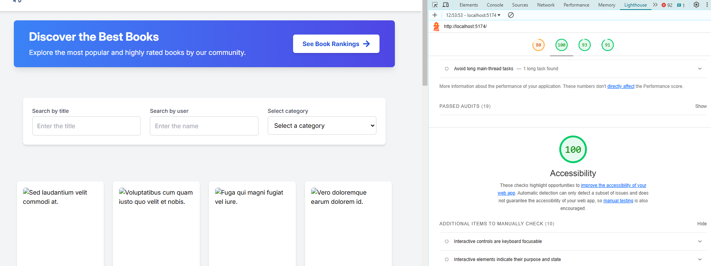

- **Puntuació d'accessibilitat:** 100% a Lighthouse.
- **Contrast visual:** La secció blava amb el text "Descobreix els millors llibres" té un contrast adequat amb el text blanc, fent-lo llegible per a usuaris amb dificultats visuals.
- **Interactivitat:** Els botons i els camps del formulari són accessibles per teclat i dispositius d'assistència.
- **Imatges:** Totes les imatges inclouen text alternatiu (`alt`), millorant l'experiència per a usuaris amb lectors de pantalla.

---

### Pàgina de Detalls del Llibre

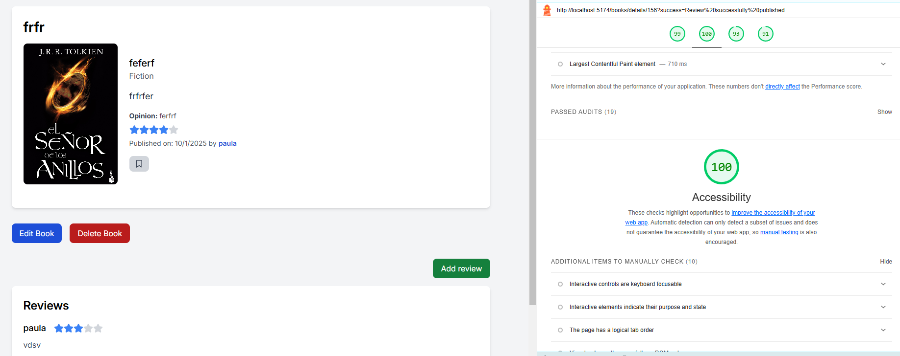

- **Disseny clar i llegible:** Jerarquia visual ben definida amb títol, gènere, qualificació i opinió clarament organitzats.
- **Accessibilitat d'interacció:** Botons com "Edita llibre", "Esborra llibre" i "Afegeix ressenya" són fàcilment navegables amb teclat.
- **Components visuals:** L'ús d'estrelles per a qualificació proporciona una representació visual clara.
- **Comentaris i ressenyes:** Correctament etiquetats per a lectors de pantalla.

---

### Pàgines de Llibres Guardats i Els Meus Llibres

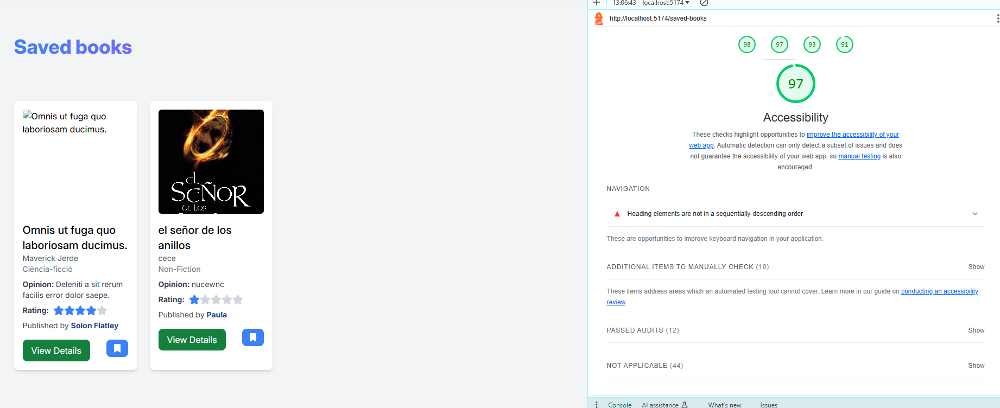 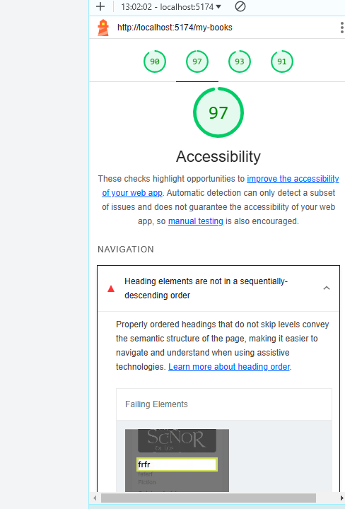

#### **Punts Positius**

- **Estructura clara:** Format de targeta amb informació clau (títol, autor, gènere, qualificació, opinió, i opcions com "Veure detalls").
- **Botons accessibles:** "Veure detalls" i la icona de marcador són clarament visibles amb bon contrast i accessibles per teclat.
- **Etiquetes adequades:** Les targetes inclouen informació clau accessible per a lectors de pantalla.
- **Qualificació Lighthouse:** Bones pràctiques implementades (etiquetes ARIA, rols i atributs necessaris).

#### **Problemes Identificats**

- **Ordre no seqüencial dels encapçalaments:** Problemes amb la jerarquia d’encapçalaments (`<h1>`, `<h3>`, `<h2>`), afectant la navegació per teclat o lector de pantalla.

---

### Pàgina del Rànquing

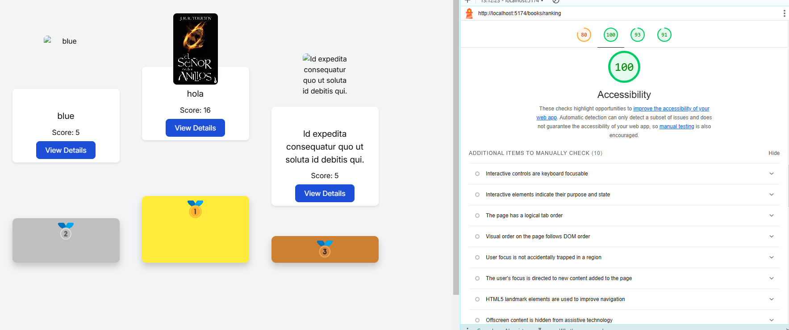

- **Puntuació d'accessibilitat:** 100% a Lighthouse.
- **Contrast visual:** Bons contrastos entre botons blaus i text blanc, així com en les medalles (or, plata i bronze).
- **Interactivitat:** Botons navegables amb teclat, facilitant l'accés a usuaris amb discapacitats motores.
- **Imatges:** Totes les imatges tenen text alternatiu descriptiu.
- **Organització:** Elements classificats segons puntuació, amb jerarquia visual clara.

---

### Formularis de l'Aplicació

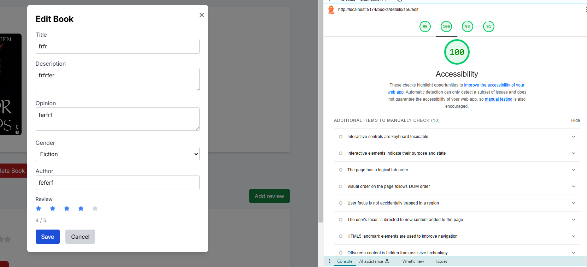

- **Puntuació d'accessibilitat:** 100% a Lighthouse.
- **Contrast visual:** Bons contrastos als botons "Save" (blau) i "Cancel" (gris).
- **Interactivitat:** Camps navegables per teclat amb etiquetes clares per proporcionar context.
- **Ordre de tabulació:** Seqüència lògica que permet passar pels camps, botons i altres elements de forma intuïtiva.
- **Feedback visual:** Botons interactius amb feedback clar quan són enfocats o clicats.

---

### Taula d'Administrador

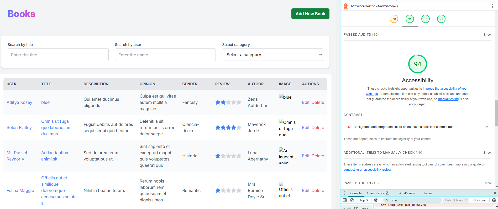

- **Puntuació d'accessibilitat:** 94% a Lighthouse.
- **Problemes detectats:**
  - **Contrast insuficient:** Text blau i vermell amb fons blanc té contrast insuficient.
- **Disseny i interactivitat:**
  - Camps de cerca ("Search by title", "Search by user") són accessibles.
  - Botons "Edit" i "Delete" clarament identificats.
- **Ordre de focus:** Navegació lògica mitjançant teclat pels elements interactius.

---

### Formulari de Registre

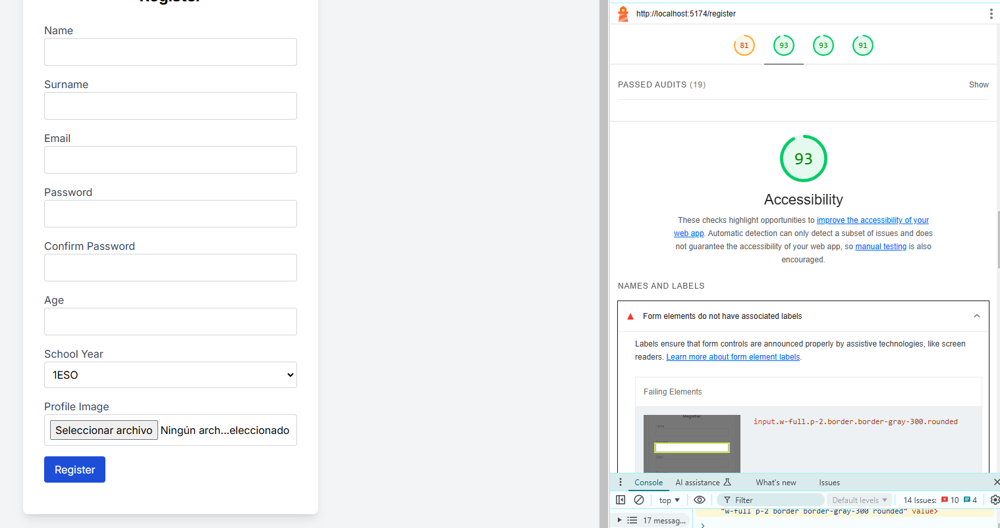

- **Puntuació d'accessibilitat:** 93% a Lighthouse.
- **Problemes detectats:**
  - Etiquetes no associades correctament als camps del formulari.
  - Falta de descripcions per al camp de càrrega d’imatges.
- **Punts Positius:**
  - Bons contrastos visuals als botons com "Register".
  - Camps de text identificables amb un ordre de focus adequat.

---

Totes les pàgines que no he mostrat són similars a altres pàgines ja descrites i compleixen els mateixos estàndards d'accessibilitat i usabilitat. Per aquest motiu, no les he inclòs, ja que el seu comportament i disseny són equivalents als exemples detallats.

# 2. Realització de Proves amb Usuaris

## Execució de les Proves

### Usuari 1

- **Registrar-se i publicar un llibre**: L'usuari s'ha registrat molt ràpidament a l'aplicació i ha trobat fàcilment el botó de publicar el llibre, ha omplert el formulari correctament i ha recomanat correctament el llibre sense cap problema, les reaccions han estat positives.
- **Posar una ressenya en un llibre que no sigui teu**: L'usuari ha tingut dificultats a trobar el botó per anar al llistat de llibres, ha tardat molt a pensar que prement el logo de l'aplicació aniria a la pàgina principal, això ha fet que l'usuari es frustrés, però quan ho ha trobat, afegir la ressenya al llibre li ha estat molt fàcil, ho ha fet correctament i molt ràpid
- **Buscar un perfil d'un usuari**: L'usuari ha trobat el perfil d'un usuari correctament, de seguida ha trobat el botó de buscar usuaris, ha escrit el nom i s'han llistat tots els perfils amb aquell nom, també ha sabut quin botó s'ha d'apretar per veure el perfil de la persona que vol
- **Editar un llibre teu**: L'usuari ha trobat molt ràpid l'apartat dels seus llibres, on allà ha pogut editar el seu llibre sense problemes i molt ràpidament
- **Guardar un llibre i trobar on es guarda**: L'usuari ha trobat el botó per guardar el llibre molt ràpid i l'apartat de llibres guardats també l'ha trobat molt ràpid
- **Editar el teu perfil**: L'usuari ha trobat el perfil i el botó d'editar molt ràpid, fent així que ha pogut editar el seu perfil sense cap problema
- **Eliminar la ressenya que abans s'ha afegit**: Al haver fet diferents funcions, l'usuari no s'enrecordava a quin llibre havia escrit la ressenya, això ha fet que trigues una mica més a trobar la seva ressenya per poder eliminar-la (també es perquè en ser dades de prova costa més recordar-se'n), m'ha recomanat fer un apartat per veure les teves ressenyes i comentaris, fora d'això un cop trobada la ressenya l'ha eliminat correctament sense problemes
- **Posar una resposta a un comentari i mostrar-la**: L'usuari ha trobat molt ràpid el botó per afegir una resposta a un comentari, també ha aconseguit ràpidament mostrar-la amb el botó de show replies.

### Usuari 2

- **Registrar-se i publicar un llibre**: L'usuari s'ha registrat molt ràpid a l'aplicació i ha trobat fàcilment el botó de publicar el llibre, ha omplert el formulari correctament i ha recomanat correctament el llibre sense cap problema, les reaccions han estat positives.
- **Posar una ressenya en un llibre que no sigui teu**: L'usuari ha tingut dificultats a trobar el botó per anar al llistat de llibres, no ha tardat tant com el primer usuari però si ha tardat més de el que m'agradaria, però quan ho ha trobat, afegir la ressenya al llibre li ha estat molt fàcil, ho ha fet correctament i molt ràpid
- **Buscar un perfil d'un usuari**: L'usuari ha trobat el perfil d'un usuari correctament, de seguida ha trobat el botó de buscar usuaris, ha escrit el nom i s'han llistat tots els perfils amb aquell nom, també ha sabut quin botó s'ha d'apretar per veure el perfil de la persona que vol
- **Editar un llibre teu**: L'usuari ha trobat molt ràpid l'apartat dels seus llibres, on allà ha pogut editar el seu llibre sense problemes i molt ràpidament
- **Guardar un llibre i trobar on es guarda**: L'usuari ha trobat el botó per guardar el llibre i l'apartat de llibres guardats molt ràpid. També ha sabut que tornant a prémer es desguardava.
- **Editar el teu perfil**: L'usuari ha trobat el perfil i el botó d'editar molt ràpid, fent així que ha pogut editar el seu perfil sense cap problema
- **Eliminar la ressenya que abans s'ha afegit**: L'usuari ha trobat ràpidament la ressenya i l'ha editat molt de pressa i correctament
- **Posar una resposta a un comentari i mostrar-la**: L'usuari ha trobat molt ràpid el botó per afegir una resposta a un comentari, també ha aconseguit ràpidament mostrar-la amb el botó de show replies.

### Usuari 3

- **Registrar-se i publicar un llibre**: L'usuari s'ha registrat molt ràpid a l'aplicació i ha trobat fàcilment el botó de publicar el llibre, ha omplert el formulari correctament i ha recomanat correctament el llibre sense cap problema, les reaccions han estat positives.
- **Posar una ressenya en un llibre que no sigui teu**: L'usuari ha trobat ràpidament que prement el logo de l'aplicació va a la pàgina principal, ha entrat a veure els detalls d'un llibre i ha posat la ressenya correctament.
- **Buscar un perfil d'un usuari**: El que primer ha fet l'usuari quan li he plantejat l'objectiu, ha estat prémer el nom de la persona que ha publicat el llibre que surt en les targetes dels llibres o en la pàgina de detalls del llibre, on allà se li ha mostrat el perfil d'aquella persona (els altres usuaris no ho han fet), després li he dit que ho fes d'una altra forma i allà ha estat quan ha trobat el lloc per buscar usuaris i ha trobat el perfil, ho ha fet tot molt ràpidament
- **Editar un llibre teu**: L'usuari ha trobat molt ràpid l'apartat dels seus llibres, on allà ha pogut editar el seu llibre sense problemes i molt ràpidament
- **Guardar un llibre i trobar on es guarda**: L'usuari ha trobat el botó per guardar el llibre i l'apartat de llibres guardats molt ràpid. També ha sabut que tornant a prémer es desguardava.
- **Editar el teu perfil**: L'usuari ha trobat el perfil i el botó d'editar molt ràpid, fent així que ha pogut editar el seu perfil sense cap problema
- **Eliminar la ressenya que abans s'ha afegit**: L'usuari ha trobat ràpidament la ressenya i l'ha editat molt de pressa i correctament
- **Posar una resposta a un comentari i mostrar-la**: L'usuari ha trobat molt ràpid el botó per afegir una resposta a un comentari, també ha aconseguit ràpidament mostrar-la amb el botó de show replies.

# 3. Anàlisi i Proposta de Millores

## Observacions durant les proves

### Usuari 1

1. **Registrar-se i publicar un llibre**: L'usuari no ha tingut cap dificultat per registrar-se ni publicar un llibre. El procés és clar i intuïtiu.
2. **Posar una ressenya en un llibre que no sigui teu**: L'usuari no va identificar immediatament com tornar a la pàgina principal, la qual cosa va generar frustració. La navegació mitjançant el logo no era evident per a ell.
3. **Buscar un perfil d'un usuari**: Cap dificultat en trobar el botó de cerca ni en seleccionar el perfil correcte.
4. **Editar un llibre teu**: L'usuari va trobar l'opció d'editar llibres molt ràpidament i va completar l'acció sense complicacions.
5. **Guardar un llibre i trobar on es guarda**: L'acció de guardar un llibre i localitzar-lo va ser ràpida i sense problemes.
6. **Editar el teu perfil**: La funcionalitat d'editar el perfil va ser fàcil de localitzar i utilitzar.
7. **Eliminar la ressenya que abans s'ha afegit**: L'usuari va tenir dificultats per recordar a quin llibre havia fet la ressenya, cosa que va retardar el procés. Va suggerir afegir un apartat per gestionar ressenyes pròpies.
8. **Posar una resposta a un comentari i mostrar-la**: L'acció va ser intuïtiva i ràpida, sense problemes.

---

### Usuari 2

1. **Registrar-se i publicar un llibre**: Com amb l'usuari 1, el procés va ser senzill i ràpid.
2. **Posar una ressenya en un llibre que no sigui teu**: Tot i que aquest usuari va tardar menys a entendre com tornar a la pàgina principal, va mostrar dificultats similars. Un cop localitzada, afegir la ressenya va ser fàcil.
3. **Buscar un perfil d'un usuari**: Va utilitzar la funcionalitat de cerca correctament i amb rapidesa.
4. **Editar un llibre teu**: Va completar l'acció de manera eficient, sense complicacions.
5. **Guardar un llibre i trobar on es guarda**: Va localitzar les opcions ràpidament i va entendre que tornar a prémer el botó desfà l'acció de guardar.
6. **Editar el teu perfil**: No va tenir cap problema per localitzar i utilitzar aquesta funcionalitat.
7. **Eliminar la ressenya que abans s'ha afegit**: L'usuari va recordar fàcilment on havia fet la ressenya i la va eliminar sense cap complicació.
8. **Posar una resposta a un comentari i mostrar-la**: Va ser capaç de completar aquesta acció ràpidament i sense dificultats.

---

### Usuari 3

1. **Registrar-se i publicar un llibre**: Va completar el procés amb facilitat i sense complicacions.
2. **Posar una ressenya en un llibre que no sigui teu**: Va comprendre ràpidament que el logo redirigeix a la pàgina principal. Aquesta acció va ser més intuïtiva per a ell.
3. **Buscar un perfil d'un usuari**: Inicialment, va fer servir un mètode alternatiu (clicar sobre el nom de l'usuari en un llibre) abans de localitzar l'opció de cerca. Ambdós mètodes van ser ràpids i efectius.
4. **Editar un llibre teu**: Va completar l'acció sense cap dificultat.
5. **Guardar un llibre i trobar on es guarda**: Va utilitzar la funcionalitat ràpidament i va entendre com desguardar el llibre si calia.
6. **Editar el teu perfil**: No va tenir cap dificultat per localitzar i utilitzar aquesta funcionalitat.
7. **Eliminar la ressenya que abans s'ha afegit**: Va trobar la ressenya ràpidament i va completar l'acció sense problemes.
8. **Posar una resposta a un comentari i mostrar-la**: L'acció va ser ràpida i intuïtiva.

---

### Resum

En resum l'aplicació és bastant intuïtiva excepte el fet que la pàgina principal només si va si clica el logo de l'aplicació, 2 usuaris han tingut problemes a trobar la pàgina principal de l'aplicació, també un usuari ha tingut problemes a trobar la review que volia editar proposant fer un apartat on es veuen totes les reviews i comentaris que has fet, fora d'això els usuaris han fet correctament totes les accions i han assolit positivament els objectius.

---

## Problemes identificats

### Prioritat alta

- Navegació a la pàgina principal poc intuïtiva, els usuaris no saben com tornar a la pàgina principal

### Prioritat mitjana

- Problema de contrast als apartats dels administradors amb els botons blaus i vermells
- Problema d'accessibilitat amb el formulari de registre amb les etiquetes dels camps del formulari.

### Prioritat baixa

- Problema al trobar una review que has fet, només un usuari ha tingut dificultat per trobar la ressenya al no enrecordant-se del llibre al qual li ha fet la ressenya, crec que es perquè són dades de prova, si fos real s'enrecordaria del llibre al qual es fa la ressenya i la trobaria fàcilment.
- Els usuaris no saben que es pot clicar en els noms de les persones que han publicat el llibre, és poc intuïtiu

## Propostes de millora

### Accessibilitat

- Canviar els tons de blau i vermell a l'apartat de l'administrador fent així que hi hagi més contrast
- Associar etiquetes als camps del formulari de registre.

### Navegació

- Afegir un botó explícit que vagi al menú principal per evitar confusions amb el logo.
- Posar els noms dels usuaris de diferent color per saber que es poden clicar

# Implementació

## Accessibilitat

### **Correcció del Formulari**

- **Millora aplicada:** He associat les etiquetes als camps del formulari, obtenint una puntuació del 100% en accessibilitat.

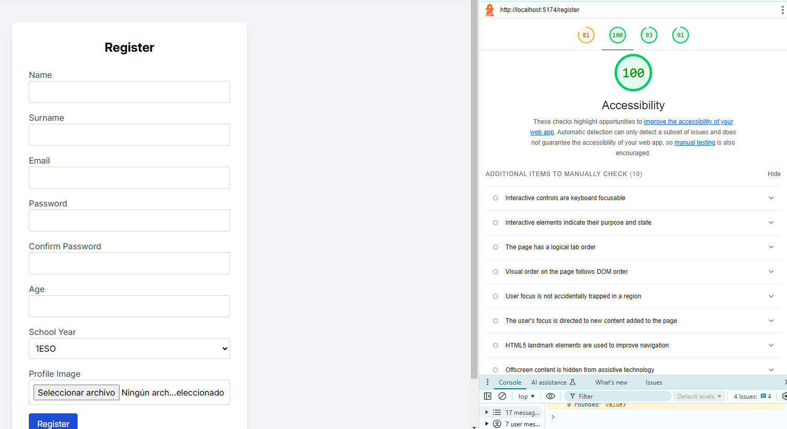

### **Correcció de Contrast**

- **Millora aplicada:** He augmentat el contrast en els colors blau i vermell, obtenint una puntuació del 100% en accessibilitat.

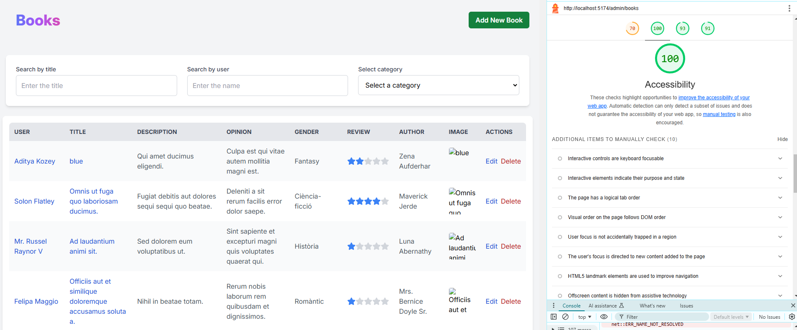

## Navegació

### **Correcció navegació a la pàgina principal**

- **Millora aplicada:** He posat un botó de 'List of books' al navbar, al costat del logo, que va a la pàgina principal, fent intuïtiva la navegació a la pàgina principal

#### Navbar abans de la correcció

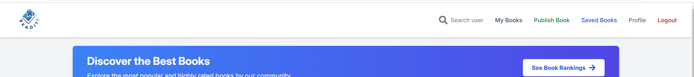

#### Navbar després de la correcció

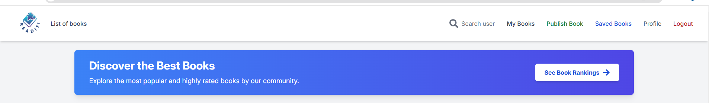

### **Correcció enllaços dels usuaris als llibres**

- **Millora aplicada:** He posat el nom de l'usuari en blau i quan passes amb el mouse per sobre es subratlla per saber que es pot clicar a sobre

#### Nom d'usuari abans de la correcció

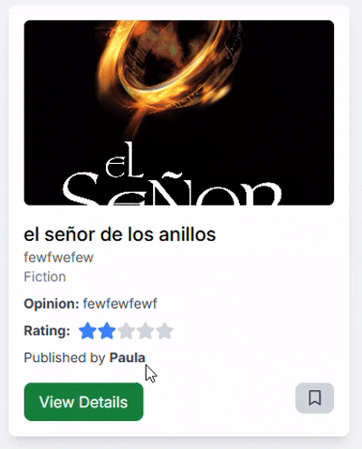

#### Nom d'usuari després de la correcció

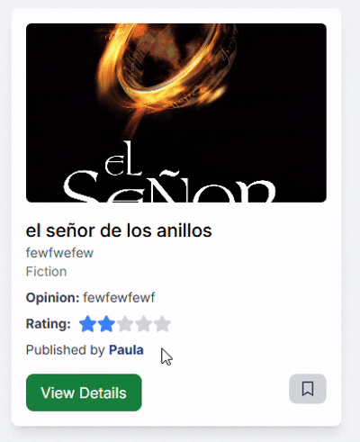
