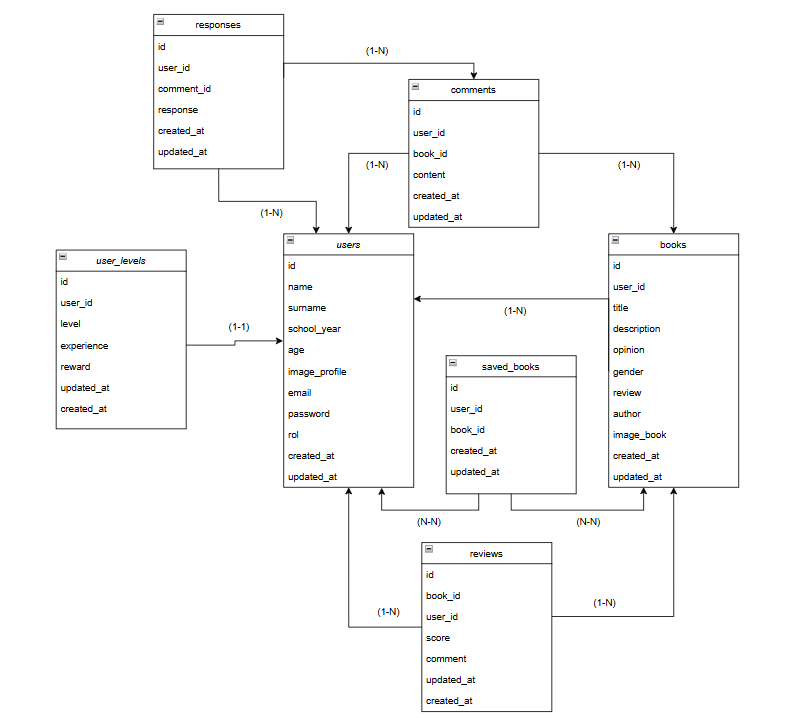
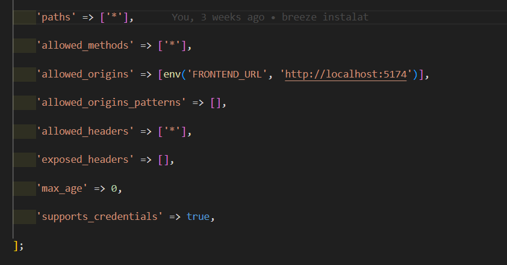

# **Descripció projecte**

Aquest projecte tracta de una aplicació per un institut on els alumnes puguin recomanar llibres als seus companys.

---

## **Funcionalitats mínimes plantajades abans de realitzar el projecte**

- Login/register.
- Editar les teves dades.
- Penjar llibres.
- Editar i eliminar els teus llibres.
- Llistar tots els llibres a la vista.
- Fer comentaris en els llibres d'altres usuaris.
- Editar i eliminar els teus comentaris o els dels teus llibres publicats.
- Fer reviews del 1 al 5 en els llibres d'altres usuaris.
- Editar i eliminar les teves reviews o els dels teus llibres publicats.
- L'usuari administrador pot eliminar i editar tots els llibres, comentaris, respostes, reviews i usuaris.
- Filtrar els llibres per gènere i es pot cercar per títol i user.
- Filtrar els usuaris per curs i es pot cercar per el nom.
- Filtrar els comentaris i valoracions per llibre i usuari.
- Respostes als comentaris.
- Editar i eliminar les teves respostes.
- Guardar llibres i que es posin a la llista de guardats.
- Sistema de nivells i experiència, acumulen punts o experiència al realitzar certes accions (com valorar llibres, escriure comentaris o fer recomanacions), i amb aquests punts pujen de nivell.

## **Funcionalitats avançades plantajades abans de realitzar el projecte**

- Rànquings de llibres segons valoracions
- Cercar un llibre en concret i que se't llistin totes les valoracions
- Vista per el perfil dels usuaris amb tots els seus llibres publicats
- Recompenses segons el nivell
- Cerca d’usuaris i poder veure el seu perfil
- Login amb Google

## **Funcionalitats realitzades**

- Login/register.
- Editar les teves dades.
- Penjar llibres.
- Editar i eliminar els teus llibres.
- Llistar tots els llibres a la vista.
- Fer comentaris en els llibres d'altres usuaris.
- Editar i eliminar els teus comentaris o els dels teus llibres publicats.
- Fer reviews del 1 al 5 en els llibres d'altres usuaris.
- Editar i eliminar les teves reviews o els dels teus llibres publicats.
- L'usuari administrador pot eliminar i editar tots els llibres, comentaris, respostes, reviews i usuaris.
- Filtrar els llibres per gènere i es pot cercar per títol i user.
- Filtrar els usuaris per curs i es pot cercar per el nom.
- Filtrar els comentaris i valoracions per llibre i usuari.
- Respostes als comentaris.
- Editar i eliminar les teves respostes.
- Guardar llibres i que es posin a la llista de guardats.
- Cerca d’usuaris i poder veure el seu perfil.
- Vista per el perfil dels usuaris amb tots els seus llibres publicats.
- Rànquings de llibres segons valoracions.

# **Backend**

### Esquema base de dades

**Taules:**

- `Responses`: id, user_id, comment_id, response, create_at, updated_at.
- `Comments`: id, user_id, book_id, content, created_at, updated_at.
- `Users`: id, name, surname, school_year, age, image_profile, email, password, rol, created_at, updated_at.
- `Books`: id, user_id, title, description, opinion, gender, review, author, image_book, created_at, updated_at.
- `Reviews`: id, book_id, user_id, score, commentupdated_at, created_at.
- `Saved_books`: id, user_id, book_id, created_at, updated_at.
- `User_levels`: id, user_id, level, experience, reward, created_at, updated_at.

**Relacions:**

- Un usuari pot tenir diversos llibres, però un llibre només pertany a un usuari (relació 1-N).
- Un usuari pot tenir diversos comentaris, però un comentari només pertany a un usuari (relació 1-N).
- Un usuari pot tenir diverses ressenyes, però una ressenya només pertany a un usuari (relació 1-N).
- Un usuari pot tenir diverses respostes, però una resposta només pertany a un usuari (relació 1-N).
- Un usuari pot tenir un nivell i el nivell només té un usuari (relació 1-1).
- Un usuari pot tenir diversos llibres guardats i aquells llibres també poden ser guardats per diversos usuaris (relació N-N).
- Un comentari pot tenir diverses respostes, però una resposta només pertany a un comentari (relació 1-N).
- Un llibre pot tenir diversos comentaris, però el comentari només pertany a un llibre (relació 1-N).
- Un llibre pot tenir diverses ressenyes, però la ressenya només pertany a un llibre (relació 1-N).
- Un llibre pot ser guardat per diversos usuaris, i diversos usuaris poden guardar el llibre (relació N-N).

---

## **Models**

- **Usuari**
- **Llibre**
- **Comentari**
- **Valoració**
- **Resposta**
- **Llibre Guardat**
- **Nivell**

---

## **Controladors**

- **AdminController:** Conté totes les funcionalitats per a l'administrador.
- **AuthController:** Funcionalitats d’autenticació com login, registre i logout.
- **BookController:** Funcionalitats de llibres com editar, eliminar, afegir i obtenir llibres.
- **CommentController:** Funcionalitats de comentaris com editar, eliminar, afegir i obtenir comentaris.
- **ProfileController:** Funcionalitats relacionades amb el perfil de l'usuari autenticat.
- **ResponseController:** Funcionalitats de respostes als comentaris.
- **ReviewController:** Funcionalitats de ressenyes (editar, eliminar, afegir).
- **SavedBookController:** Funcionalitats per gestionar llibres guardats.
- **UserLevelController:** Funcionalitats per gestionar nivells d'usuari.
- **UsersController:** Funcionalitats de gestió d'usuaris (actualitzar, obtenir per ID).

Cada controlador extén una classe base Controller que inclou una funció anomenada responseMessage. Aquesta funció s'utilitza per retornar respostes estandarditzades a l'usuari, amb un codi d'estat, un missatge i opcionalment dades. Això permet evitar la duplicació de codi i garantir que totes les respostes segueixin el mateix format, millorant la coherència i mantenibilitat del projecte.

---

# **Frontend**

### Components

En el frontend, he creat diversos components per reutilitzar el codi i mantenir l'organització, com formularis, targetes de llibres, filtres, navbars, i taules per a l’administrador.

### Carpeta `data`

A la carpeta `data` hi ha:

- **data.ts:** On faig totes les peticions a l'API.
- **types.ts:** Conté totes les interfícies de TypeScript per a usuaris, llibres, ressenyes, comentaris, etc.

### Carpeta `helpers`

A la carpeta `helpers` hi ha un arxiu:

- **cookies.ts:** Funció per obtenir el token de les cookies, utilitzada per fer les peticions a l'API.

### Carpeta `util`

A la carpeta `util` hi ha:

- **validacions.ts:** Conté totes les validacions dels formularis.
- **css:** Estils per a la pàgina de rànquings.

## **Rutes**

Al meu projecte, he fet servir les rutes de Remix per gestionar les diferents pàgines i funcionalitats de l'aplicació.

### Exemple de rutes:

- routes/\_index.tsx: Representa la pàgina principal o landing page.
- routes/admin.books.tsx: Pàgina de llibres del panell d'administració.
- routes/admin.books.edit.$id.tsx: Pàgina d'edicio de llibres de l'administració

### Exemple rutes dinàmiques

He utilitzat rutes dinàmiques per gestionar pàgines que depenen de dades específiques, com per exemple:

- routes/books.details.$id.tsx: Aquesta ruta mostra els detalls d'un llibre específic. El paràmetre $id s'utilitza per identificar el llibre.
- routes/admin.users.edit.$id.tsx: Pàgina que permet editar la informació d'un usuari específic al panell d'administració.

### Rutes per funcions específiques

Administració: Les rutes que començen amb admin estan pensades per funcionalitats específiques dels administradors, com gestionar llibres, usuaris, comentaris...

### Navegació entre rutes

Per facilitar la navegació entre rutes, faig servir el component Link de Remix o el navigate, que millora el rendiment de l'aplicació gràcies a la seva capacitat de pre-carregar les dades abans que l'usuari canviï de pàgina. Això proporciona una experiència més ràpida i fluida. A més en els actions faig servir el redirect amb missatges de success o error

## Protecció de rutes

Les rutes privades, com el panell d'administració, estan protegides mitjançant un sistema d'autenticació. Abans de carregar el contingut, es comprova si l'usuari té els permisos adequats.

## Us de actions i loaders

En el meu projecte, utilitzo actions per gestionar operacions que impliquen el canvi d'estat, com ara enviar formularis, editar dades, o eliminar elements. Les actions es processen quan es fa una petició POST i permeten modificar dades a través del backend.

Per altra banda, utilitzo loaders per carregar dades de manera eficient i mostrar-les en la interfície. Els loaders són funcionals per a les peticions GET i es criden abans de renderitzar la pàgina per assegurar-se que les dades necessàries estan disponibles. Això permet que les dades es carreguin de forma reactiva i que la pàgina es mostri de manera optimitzada i amb menys càrrega al client.

Aquesta separació entre actions i loaders em permet tenir una arquitectura més neta i controlada: mentre que les actions gestionen les operacions de canvi, els loaders s'encarreguen de la recuperació de dades per la visualització.

# **Desafiaments durant el projecte**

### **Configuració inicial: Problemes amb CORS**

Quan vaig començar a treballar amb Remix, em vaig trobar amb un problema important, el backend de Laravel bloquejava totes les peticions cap a l'API. Això era degut a una configuració incorrecta de les CORS al fitxer config/cors.php del projecte Laravel. Vaig haver de modificar aquesta configuració per permetre que el backend acceptés peticions des de la URL del frontend.

### **Rutes de Remix**

Al començament, al no tenir gaire experiencia amb Remix, vaig trobar dificultats amb les rutes dinàmiques, especialment en estructures més complexes com ara books.details.$id.tsx i subrutes com books.details.$id.comments.add. Aquestes no funcionaven correctament perquè no havia configurat adequadament el component <Outlet /> dins de les rutes pare.
El problema principal era que les pàgines que depenien de subrutes no carregaven bé el contingut dinàmic. Això es deu al fet que Remix utilitza el component <Outlet /> per renderitzar el contingut de les subrutes dins de la ruta pare. Sense aquest component, les subrutes no es mostraven, i vaig perdre força temps intentant entendre què estava fallant.

A mesura que avançava amb el projecte, vaig començar a entendre millor com funcionava la jerarquia de rutes en Remix. Vaig decidir fer primer les funcionalitats de l'usuari perquè requerien una estructura de rutes més variada i complexa. Això em va permetre familiaritzar-me amb:

- **Rutes dinàmiques:** per exemple, com utilitzar $id per capturar paràmetres dinàmics dins de les URL.
- **Subrutes i layouts:** com fer servir el component <Outlet /> per permetre que les subrutes es renderitzessin dins de les rutes pare.

Un cop vaig dominar les rutes d'usuari, vaig aplicar aquest coneixement a les rutes de l'administrador. Aquest procés va ser molt més ràpid i senzill, ja que ja coneixia les bases i entenia com estructurar correctament les rutes per a funcionalitats com ara editar o eliminar llibres.

### **Problemes amb el Form i els actions**

Al principi, no sabia com fer funcionar l'action a Remix, ja que no estava familiaritzat amb la manera en què es gestionen els formularis i les peticions POST dins de les rutes. Però, després de buscar informació i revisar el projecte que vam fer a classe, vaig poder entendre millor com s'utilitzaven els actions. Vaig veure que aquestes funcions s'associen directament als formularis per processar les dades enviades, i un cop vaig comprendre com s'aplicaven, vaig poder integrar-les ràpidament al meu projecte. També vaig dedicar molt temps amb aixó

## **Conclusions Finals**

Aquest projecte ha estat un gran aprenentatge. Tot i els desafiaments inicials amb Remix, he après a estructurar millor les rutes i a treballar amb una arquitectura escalable tant al frontend com al backend. Els coneixements adquirits seran molt útils per a projectes futurs.
